# 🏗️ Aegis Enterprise AI Architecture Overview

Welcome to the architectural blueprint of **Aegis Enterprise AI** — a sovereign, quantum-enhanced cognitive AI system designed for industrial-grade intelligence and secure multi-component orchestration.

---

## 🌐 System Components

```mermaid
graph TD
    User[👤 User Interface] --> Core[Aegis Core System]
    Core --> Quantum[⚛️ Quantum Reasoning Engine]
    Core --> Cognitive[🧠 Cognitive Processor]
    Core --> Nodes[🔌 Universal Node System]
    Core --> Security[🛡️ Security Subsystem]

    Quantum --> Entanglement[🔗 Quantum Entanglement Manager]
    Quantum --> Algorithms[🧮 Quantum Algorithms]

    Cognitive --> Perception[👁️ Perception Module]
    Cognitive --> Memory[🗄️ Memory System]
    Cognitive --> Learning[📚 Learning Engine]
    Cognitive --> Solver[🧩 Problem Solver]

    Nodes --> Language[💻 Language Execution Nodes]
    Nodes --> Platform[🖥️ Platform Nodes]
    Nodes --> Network[🌐 Network Nodes]
    Nodes --> AIEnhancement[🤖 AI Enhancement Nodes]

    Security --> Signatures[🔑 Cognitive Signatures]
    Security --> Crypto[🔐 Quantum Cryptography]
    Security --> Threats[🚨 Threat Detection]
```

---

## 🔑 Key Features

- **Quantum-Enhanced Reasoning**: Utilizes quantum entanglement and algorithms to boost cognitive processing.
- **Multi-Component Processing (mCP)**: Flexible JSON-driven configuration supporting HTTP, WebSocket, gRPC, and local protocols.
- **Robust Security**: Cognitive signature authentication replaces traditional API keys, with real-time threat detection.
- **Extensible Node System**: Supports platform, browser, AI enhancement, and language execution nodes.
- **Hybrid Intelligence**: Seamlessly integrates offline and online AI capabilities.
- **Cross-Platform Interfaces**: REST API, WebSocket, CLI, and mobile bridge for Android/iOS.

---

## ⚙️ Deployment Flow

1. **Initialization**: Core system boots quantum processor, security engine, and node manager.
2. **Configuration**: Loads JSON configs for mCP, nodes, and security.
3. **Node Loading**: Registers all nodes (platform, AI, language, browser).
4. **Request Handling**: API or CLI inputs are processed through orchestrator.
5. **Quantum Processing**: Tasks are optimized and secured via quantum processor.
6. **Execution**: Nodes execute tasks and return results.
7. **Response**: Results are returned with cognitive metadata and security signatures.

---

## 📈 Scalability & Security

- Dynamic node registration allows scaling and adding new capabilities.
- Quantum cryptography ensures end-to-end secure communication.
- Cognitive signatures provide keyless, quantum-resistant authentication.
- Threat detection monitors runtime for injection and adversarial patterns.

---

## 💬 Summary

Aegis Enterprise AI is designed to be a sovereign, secure, and extensible AI platform that leverages quantum principles and multi-component orchestration to deliver advanced cognitive capabilities across diverse environments.

---
