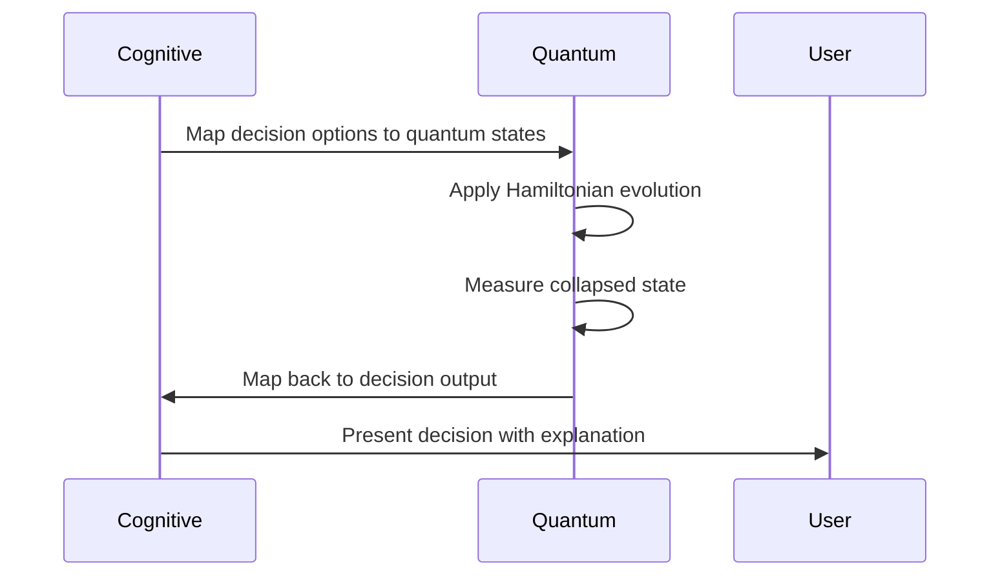

# 🔗 Quantum-Cognitive Mapping in Aegis Enterprise AI

Welcome to the Quantum-Cognitive Mapping guide — bridging the abstract world of quantum mechanics with cognitive AI principles. 💡⚛️🧠

---

## 🧩 Concept Translation Table

| Cognitive Concept   | Quantum Analogue         | Implementation Class               |
|--------------------|-------------------------|----------------------------------|
| Uncertainty        | Superposition           | `QuantumReasoner.superposition_map()` |
| Relationships      | Entanglement            | `EntanglementManager`             |
| Decision Making    | Wavefunction Collapse   | `QuantumCognitiveBridge.decision_collapse()` |
| Learning           | Quantum Annealing       | `CognitiveProcessor.quantum_anneal()` |

---

## 🔬 Quantum Algorithms Used

- **Grover's Algorithm**: Quantum search optimization  
- **Shor's Algorithm**: Integer factorization  
- **Variational Quantum Eigensolver (VQE)**: Quantum chemistry simulations  

---

## 🧠 Cognitive to Quantum Mapping Flow

---

## 🧮 Key Equations

1. **Entangled State Vector**:  
   \|ψ⟩ = (1/√2)(\|00⟩ + \|11⟩)

2. **Quantum Measurement Expectation**:  
   ⟨M⟩ = ⟨ψ| M |ψ⟩

3. **Quantum-Classical Bridge**:  
   Cognitive Weight = -log₂(Quantum Probability)

---

## 🌌 Physical Manifestations

- Non-local correlations defy classical intuition  
- Entanglement is essential for quantum computing and communication  
- Quantum states cannot be factored into independent subsystems  

---

## 💬 Summary

Aegis Enterprise AI leverages these quantum-cognitive mappings to enhance reasoning, decision-making, and learning, creating a truly sovereign and powerful AI system.

---
